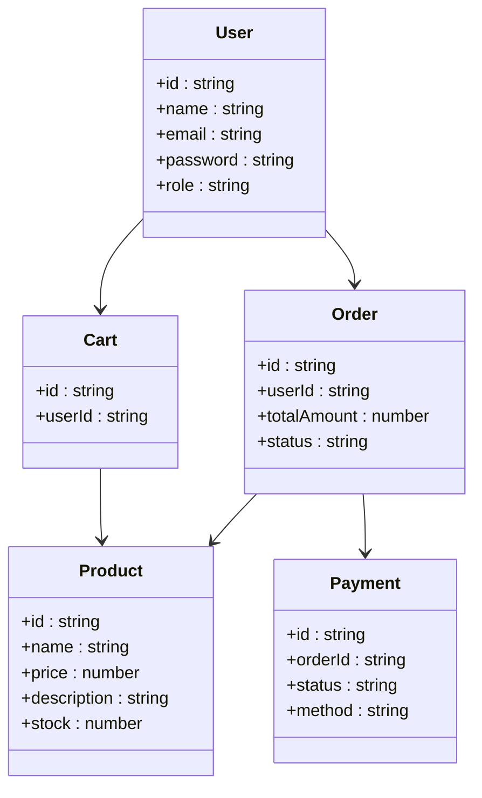

# class Diagram

```mermaid
classDiagram
    class User {
        +id : string
        +name : string
        +email : string
        +password : string
        +role : string
    }

    class Product {
        +id : string
        +name : string
        +price : number
        +description : string
        +stock : number
    }

    class Cart {
        +id : string
        +userId : string
    }

    class Order {
        +id : string
        +userId : string
        +totalAmount : number
        +status : string
    }

    class Payment {
        +id : string
        +orderId : string
        +status : string
        +method : string
    }

    User --> Cart
    User --> Order
    Cart --> Product
    Order --> Product
    Order --> Payment
```