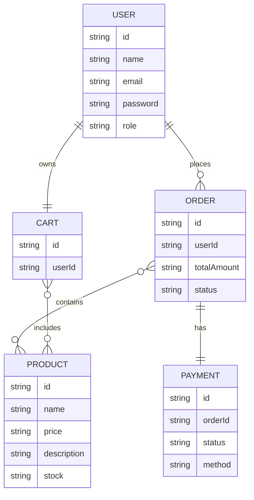

# ER Diagram

```mermaid
erDiagram
    USER ||--|| CART : owns
    USER ||--o{ ORDER : places
    ORDER ||--|| PAYMENT : has
    ORDER }o--o{ PRODUCT : contains
    CART }o--o{ PRODUCT : includes

    USER {
        string id
        string name
        string email
        string password
        string role
    }

    PRODUCT {
        string id
        string name
        string price
        string description
        string stock
    }

    CART {
        string id
        string userId
    }

    ORDER {
        string id
        string userId
        string totalAmount
        string status
    }

    PAYMENT {
        string id
        string orderId
        string status
        string method
    }
```