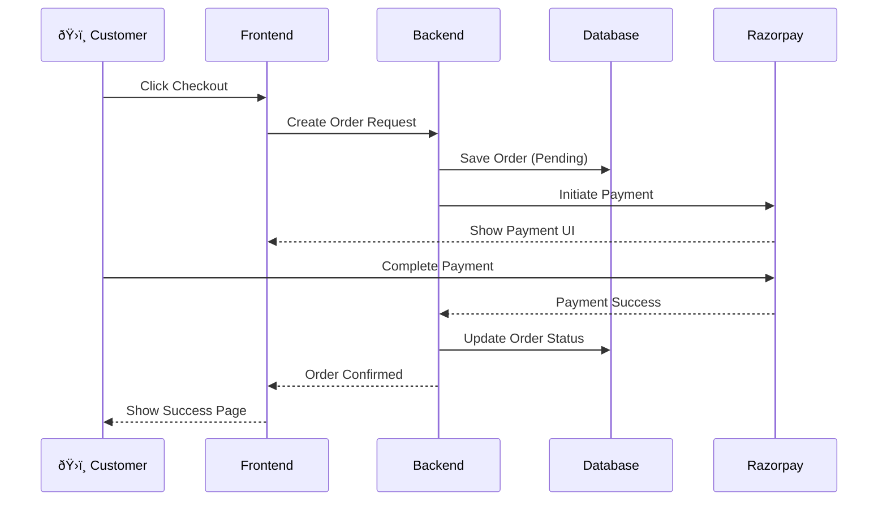

# sequence Diagram

```mermaid
sequenceDiagram
    participant User as ðŸ›ï¸ Customer
    participant UI as Frontend
    participant API as Backend
    participant DB as Database
    participant Pay as Razorpay

    User->>UI: Click Checkout
    UI->>API: Create Order Request
    API->>DB: Save Order (Pending)

    API->>Pay: Initiate Payment
    Pay-->>UI: Show Payment UI

    User->>Pay: Complete Payment
    Pay-->>API: Payment Success

    API->>DB: Update Order Status
    API-->>UI: Order Confirmed
    UI-->>User: Show Success Page
```