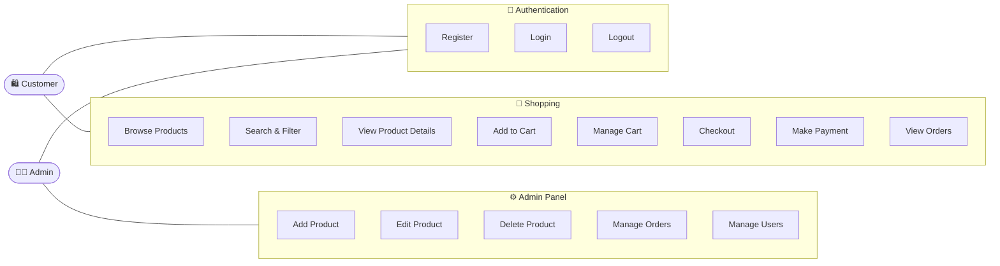

# useCase Diagram

```mermaid
flowchart LR
    Customer(["🛍️ Customer"])
    Admin(["🧑‍💼 Admin"])

    subgraph AUTH["🔐 Authentication"]
        direction TB
        UC1["Register"]
        UC2["Login"]
        UC3["Logout"]
    end

    subgraph SHOP["🛒 Shopping"]
        direction TB
        UC4["Browse Products"]
        UC5["Search & Filter"]
        UC6["View Product Details"]
        UC7["Add to Cart"]
        UC8["Manage Cart"]
        UC9["Checkout"]
        UC10["Make Payment"]
        UC11["View Orders"]
    end

    subgraph ADMIN_PANEL["⚙️ Admin Panel"]
        direction TB
        UC12["Add Product"]
        UC13["Edit Product"]
        UC14["Delete Product"]
        UC15["Manage Orders"]
        UC16["Manage Users"]
    end

    Customer --- AUTH
    Customer --- SHOP

    Admin --- AUTH
    Admin --- ADMIN_PANEL
```